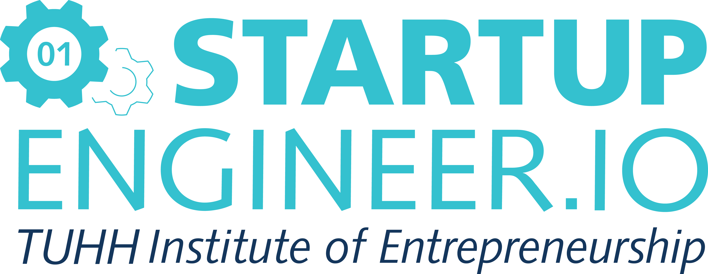

# **DS101 & DS102**

### *Data-Driven Entrepreneurship: Basic Tools and Algorithms & Project Applications* {style="padding-top: 0px;"}

This is a class for prgoramming with R. It will teach you how to program in R, with hands-on examples. I wrote it for non-programmers to provide a friendly introduction to the R language. You’ll learn how to load data, assemble and disassemble data objects, navigate R’s environment system, write your own functions, and use all of R’s programming tools. Throughout the book, you’ll use your newfound skills to solve practical data science problems.

Instructor: 

* Prof. Christoph Ihl [christoph.ihl@tuhh.de](christoph.ihl@tuhh.de)
* Joschka Schwarz [joschka.schwarz@tuhh.de](joschka.schwarz@tuhh.de)

## Content of the class

1. Data mangling in the tidyverse

2. Statistical Analysis

3. Text analysis

4. Miscellaneous

### [Startup Engineer](https://www.startupengineer.io)

<a href = "https://www.startupengineer.io">

